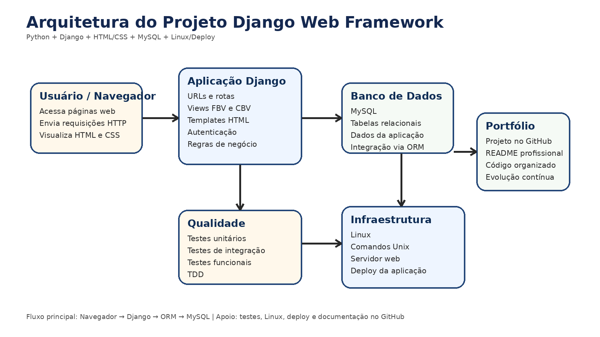
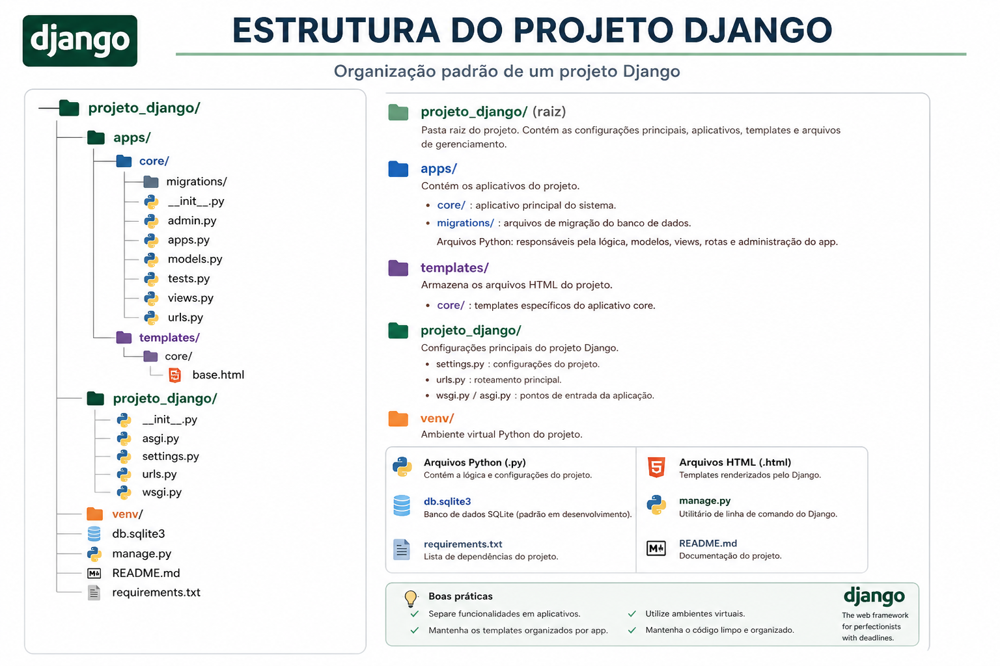
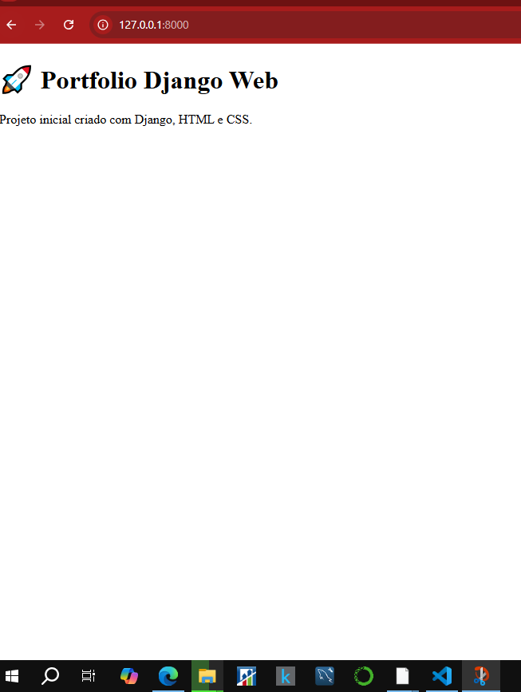

# 🚀 Sistema Web - Projeto Django Web Framework

## 📌 Sobre o Projeto 

Este repositório contém materiais, estudos e práticas cujo objetivo é consolidar conhecimentos em **desenvolvimento web full stack**, utilizando Python como base, com foco na construção de aplicações modernas, escaláveis e profissionais.

---

## 🧠 Contexto

Após aprender Python, é comum perceber que a linguagem exige uma especialização para aplicação prática no mercado.
Uma das áreas mais consolidadas e com alta demanda é o **desenvolvimento web**.

Dentro desse cenário, o **Django** se destaca como o framework mais popular do ecossistema Python para criação de aplicações web robustas.

---

## ⚙️ O que é o Django?

O Django é um framework web de alto nível que permite criar aplicações completas com rapidez e eficiência.

Com ele, é possível desenvolver:

* 🌐 Sites completos
* 🔌 APIs REST
* 🧩 Sistemas administrativos
* 🔐 Aplicações com autenticação de usuários

Tudo isso com uma estrutura organizada e seguindo boas práticas de desenvolvimento.

---

## 🛠️ Principais Recursos do Django

O Django já vem com diversas funcionalidades prontas, o que acelera muito o desenvolvimento:

* 🗄️ ORM (Object Relational Mapper) para integração com bancos SQL
* 🎨 Sistema de Templates (HTML dinâmico)
* ⚙️ Views baseadas em função (FBV) e classe (CBV)
* 🔐 Sistema de autenticação completo
* 🛠️ Painel administrativo automático
* 🔄 Migrations para controle de banco de dados

---
## Arquitetura do Projeto

  

## 🖼️ Estrutura do Projeto Django

  

## 📚 Conteúdos Abordados 

São explorados conceitos fundamentais e avançados:

### 🐍 Backend

* Python aplicado ao desenvolvimento web
* Arquitetura do Django
* Criação de APIs

### 🌐 Frontend

* HTML5
* CSS3
* Integração com templates do Django

### 🧪 Qualidade de Software

* Testes unitários
* Testes de integração
* Testes funcionais
* TDD (Test Driven Development)

### 🗄️ Banco de Dados

* SQL com MySQL
* Modelagem de dados
* Integração com ORM

### 🖥️ Infraestrutura

* Comandos Unix/Linux para servidores
* Deploy de aplicações web
* Fundamentos do protocolo HTTP

---

## 🎯 Objetivo do Repositório

* 📌 Consolidar aprendizado prático
* 📌 Criar projetos reais com Django
* 📌 Servir como portfólio profissional
* 📌 Demonstrar domínio em desenvolvimento web

---

## 🚀 Tecnologias Utilizadas

* Python 🐍
* Django 🌐
* HTML5 📄
* CSS3 🎨
* MySQL 🗄️
* Linux 🐧

---

## 📈 Possibilidades com Django

Com o Django, você pode desenvolver:

* Sistemas empresariais
* Portais web
* APIs para aplicativos mobile
* Sistemas de autenticação
* Dashboards administrativos

---

## Ao final da primeira fase do projeto teremos esta configuração

## 🖼️ Tela Inicial do Sistema

  <a href="imagens/tela_home_1.png"  
    
  </a>

 
## 📌 Conclusão    

O Django é uma das ferramentas mais completas para desenvolvimento web com Python.
Com ele, é possível criar aplicações profissionais com rapidez, organização e segurança.

---

## 👨‍💻 Autor

**Lúcio Fábio Barbosa de Lima**
📧 engenheirodedados.luciofabio@gmail.com  
🔗 [LinkedIn](https://linkedin.com/in/lúcio-fábio-barbosa)

---

